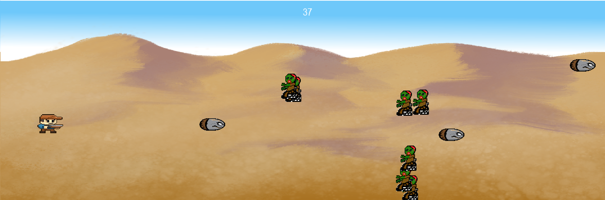

# Simple2DZombieShooter
A fast-paced 2D zombie shooter made for the **ConUHacks hackathon**. Survive waves of zombies for as long as possible while dodging attacks and shooting enemies!

## Goal
The goal of the game is to survive as long as possible without letting the zombies reach the left edge or touch you. 
Good luck and have fun!

## Features
- Fast-paced 2D gameplay
- Simple controls (UP/DOWN to move, SPACE to shoot)
- Endless waves of zombies
- Retro-style visuals

## Controls
- **UP/DOWN**: Move up and down
- **SPACE**: Shoot enemies

## Gameplay

*Survive waves of zombies while avoiding their attacks!*

## Loading Screen

*The game's loading screen before the action begins.*

## How to Run
1. Install [Conda](https://docs.conda.io/en/latest/miniconda.html) if you don’t have it installed.
2. Clone this repository: `git clone https://github.com/zhg-dean/Simple2DZombieShooter.git`
3. Navigate to the base directory of the repository: `cd Simple2DZombieShooter`
4. Create and activate the Conda environment: `conda create --name zombie_env --file requirements.txt conda activate zombie_env`
5. Run the game: `python game.py` 

## Credits
Developed by Dean Zhang during the ConUHacks hackathon.
